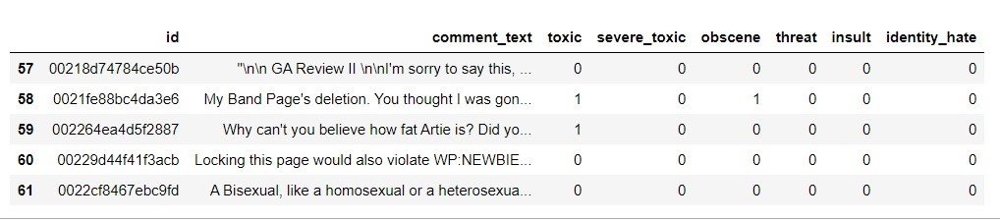
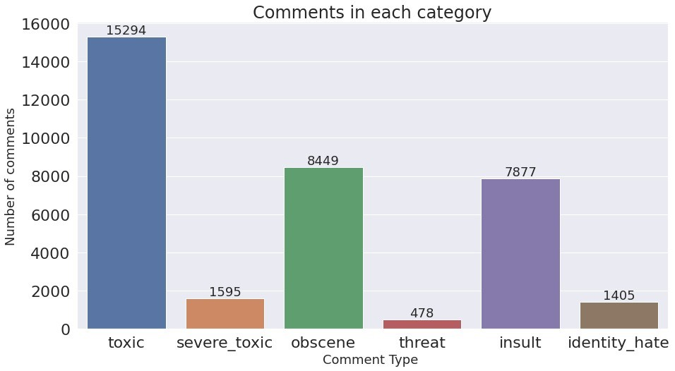
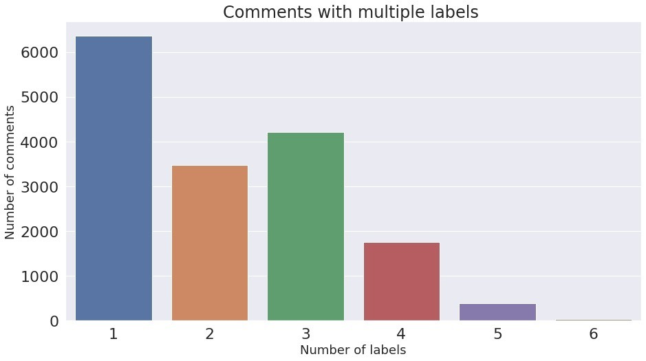
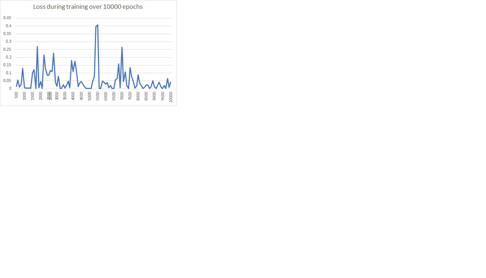
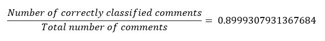

# Toxic-Comment-Classification-using-BERT
Built a text classification model using pretrained BERT base-uncased model

**Problem Statement:**  
Comment classification using BERT contextual model. Given a dataset of comments, the task is to classify them based upon the context of the words. There are 6 classes; toxic, severe_toxic, obscene, threat, identity_hate.

**BERT (Bidirectional Encoder Representations from Transformers):** 
BERT is the first deeply bidirectional, unsupervised language representation, pre-trained using only a plain text corpus. BERT makes use of Transformer, an attention mechanism that learns contextual relations between words (or sub-words) in a text. In its vanilla form, Transformer includes two separate mechanisms — an encoder that reads the text input and a decoder that produces a prediction for the task.
As opposed to directional models, which read the text input sequentially (left-to-right or right-to-left), the Transformer encoder reads the entire sequence of words at once. Therefore, it is considered bidirectional, though it would be more accurate to say that it’s non-directional. This characteristic allows the model to learn the context of a word based on all of its surroundings (left and right of the word).
Context-free models such as word2vec or GloVe generate a single word embedding representation for each word in the vocabulary. Contextual models instead generate a representation of each word that is based on the other words in the sentence. Contextual representations can further be unidirectional or bidirectional.
Multi-class classification & Multi-label classification: 
Difference between multi-class classification & multi-label classification is that in multi-class problems the classes are mutually exclusive, whereas for multi-label problems each label represents a different classification task, but the tasks are somehow related.

**Dataset:** 
The dataset contains a large number of comments which are to be classified according to the level of toxicity. It has 8 fields - id, comment_text and the 6 labels. Each instance is associated with a set of labels.
Get the dataset from <a href="https://www.kaggle.com/c/jigsaw-toxic-comment-classification-challenge/data">here</a>

**Modelling:** 
Google Research has provided several pre-trained models that implement BERT. We have used the uncased-bert-base.

    {
      "architectures": [
        "BertForMaskedLM"
      ],
      "attention_probs_dropout_prob": 0.1,
      "hidden_act": "gelu",
      "hidden_dropout_prob": 0.1,
      "hidden_size": 768,
      "initializer_range": 0.02,
      "intermediate_size": 3072,
      "layer_norm_eps": 1e-12,
      "max_position_embeddings": 512,
      "model_type": "bert",
      "num_attention_heads": 12,
      "num_hidden_layers": 12,
      "pad_token_id": 0,
      "type_vocab_size": 2,
      "vocab_size": 30522
    }

The Bert-Base model has 12 attention layers and all text will be converted to lowercase by the tokeniser.

You can get the BERT-base-uncased model <a href="https://storage.googleapis.com/bert_models/2018_10_18/uncased_L-12_H-768_A-12.zip">here.</a>

**Analysis:** 

